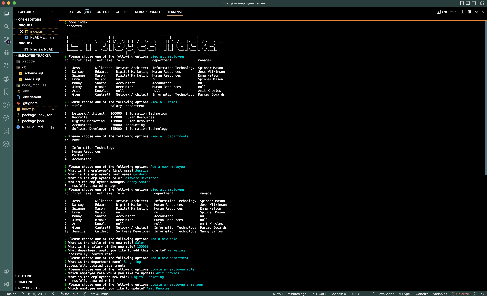

# Employee Tracker
## Table of Contents
* [Description](#description)
* [Built With](#languages)
* [Installation](#installation)
* [Contributing](#contributing)
* [Usage](#usage)
* [Testing](#tests)
* [Questions](#questions)
* [Application Preview](#application-preview)

    
       

## [Description](#table-of-contents)
A Node.js CLI application that allows businesses to track staff by name, roles, and departments. Employee tracking is done using tables generated with Inquirer and MySQL.

## [Languages](#table-of-contents)
JavaScript, Node.js, MySQL

## [License](#table-of-contents)
The application is covered under the following license:  
    [MIT](https://choosealicense.com/licenses/MIT)
      
      

## [Usage](#table-of-contents)
* Add departments, roles, and employees
* View all departments, roles, employees, and managers
* Update employee role, department, managers
* Delete employee, role, department, managers

## [Testing](#table-of-contents)
N/A

## [Contributing](#table-of-contents)

Thank you for your interest in contributing to this project, however, I am currently not accepting third party contributions.
      

## [Installation](#table-of-contents)
* `git clone https://github.com/jessica-calderon/employee-tracker`
* Install all dependencies from root project folder using
`npm install`
* Run program using `node server`

## [Application Preview](#table-of-contents)
Click the image to see the live demo.

## [Questions](#table-of-contents)
Questions? Please contact me at the following links:  
[GitHub](https://github.com/jessica-calderon)  
[Email: calderonjessica13@yahoo.com](mailto:calderonjessica13@yahoo.com)
